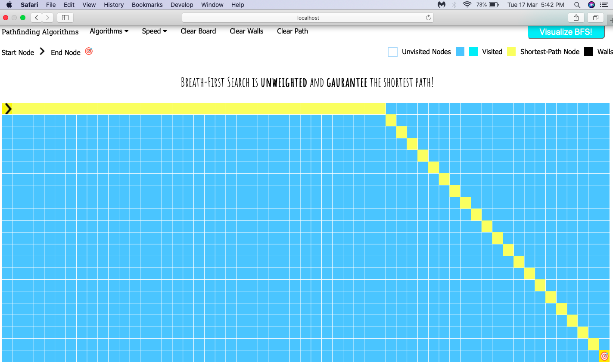

# Welcome to Pathfinding Visualizer! I built this application because I wanted to visualize them in action

># Try (use Safari or Chorme): https://ankitsadhu.github.io/Pathfinding-Visualizer/ 

ScreenShot



# What you need to run this

>To run on your MacOs/Windows open terminal find the folder e.g-

```bash
    cd 'Downloads/Pathfinding Visualizer'

    python -m SimpleHTTPServer
```

Open Chrome http://localhost:8000/